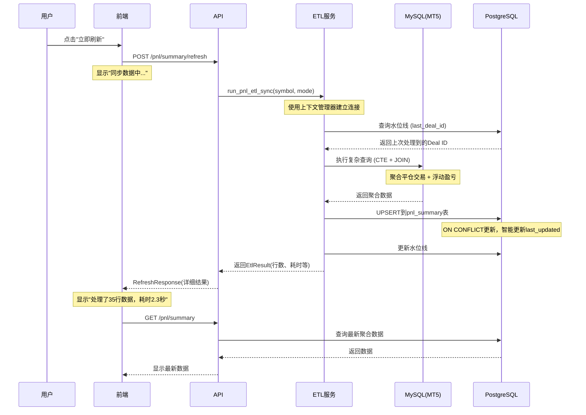

# ETL 服务架构与扩展指南

本文档详细介绍了盈亏汇总ETL服务的设计理念、核心架构和扩展方法。

## 📋 目录

- [架构概述](#架构概述)
- [核心组件](#核心组件)
- [数据流程](#数据流程)
- [关键设计理念](#关键设计理念)
- [扩展指南](#扩展指南)
- [最佳实践](#最佳实践)
- [故障排查](#故障排查)

---

## 🏗 架构概述

### **从subprocess到函数调用的演进**

**旧架构问题：**
```
前端 → API → subprocess.Popen → 独立Python脚本 → 数据库
                ↑ 无法获取状态和结果
```

**新架构优势：**
```
前端 → API → ETL服务函数 → 数据库
         ↑ 同步执行，返回详细结果
```

### **文件结构**
```
backend/app/services/
├── etl_service.py           # ETL核心逻辑 (~305行)
│   ├── PnlEtlService       # 主要ETL服务类
│   ├── EtlResult           # 执行结果数据类
│   └── run_pnl_etl_sync()  # 便利函数
├── pnl_summary_service.py   # API服务层 (~60行)
└── ...
```

---

## 🔧 核心组件

### **1. EtlResult 数据类**
```python
@dataclass
class EtlResult:
    success: bool              # 执行是否成功
    processed_rows: int        # 处理的数据行数
    new_max_deal_id: int      # 新的最大交易ID（水位线）
    start_time: datetime      # 开始时间
    end_time: datetime        # 结束时间
    error_message: Optional[str] = None  # 错误信息
    
    @property
    def duration_seconds(self) -> float:
        return (self.end_time - self.start_time).total_seconds()
```

### **2. PnlEtlService 服务类**
```python
class PnlEtlService:
    def __init__(self):
        # 初始化数据库配置
        
    def __enter__(self) / __exit__(self):
        # 上下文管理器：自动处理数据库连接
        
    def run_pnl_sync(self, symbol: str, mode: str) -> EtlResult:
        # 核心ETL执行方法
        
    def _get_watermark(self, symbol: str) -> int:
        # 增量同步水位线管理
        
    def _get_extract_sql_template(self, is_incremental: bool) -> str:
        # 动态SQL构建
```

### **3. 配置管理**
```python
# Volume换算配置 - 区分标准账户和美分账户
VOLUME_DIVISORS = {
    'XAUUSD.kcmc': 10000.0,  # 美分账户
    'XAUUSD.kcm': 10000.0,   # 美分账户
    'EURUSD': 100.0,         # 标准账户（示例）
    '__default__': 100.0     # 默认值
}
```

---

## 🔄 数据流程

### **新的刷新流程图**



### **ETL核心SQL逻辑**

```sql
-- 1. 平仓交易汇总
WITH ClosedDealsSummary AS (
    SELECT Login, 
           COUNT(Deal) AS total_closed_trades,
           SUM(CASE WHEN Action = 0 THEN 1 ELSE 0 END) AS buy_trades_count,
           SUM(Profit) AS total_closed_pnl,
           MAX(Deal) as max_deal_id
    FROM mt5_deals d
    WHERE d.symbol = 'XAUUSD.kcmc' 
      AND d.entry IN (1, 3)  -- 平仓类型
      AND d.Deal > {last_deal_id}  -- 增量条件
    GROUP BY Login
),

-- 2. 当前持仓浮动盈亏
OpenPositionsSummary AS (
    SELECT Login, SUM(Profit) AS floating_pnl
    FROM mt5_positions
    WHERE symbol = 'XAUUSD.kcmc'
    GROUP BY Login
),

-- 3. 合并数据并关联用户信息
...
```

---

## 💡 关键设计理念

### **1. 智能的last_updated更新**
```sql
-- 只有在数据真正变化时才更新时间戳
last_updated = CASE 
    WHEN pnl_summary.total_closed_trades <> (pnl_summary.total_closed_trades + EXCLUDED.total_closed_trades)
      OR pnl_summary.floating_pnl <> EXCLUDED.floating_pnl
      OR ... -- 其他字段变化检查
    THEN NOW()  -- 有变化：更新为当前时间
    ELSE pnl_summary.last_updated  -- 无变化：保持原时间
END;
```

**业务意义**：`last_updated` 现在代表"该客户在该品种最后活跃的时间"，而不是ETL运行时间。

### **2. 水位线机制**
```python
# 增量同步：只处理新的交易
last_deal_id = self._get_watermark(symbol)  # 获取上次处理位置
# WHERE d.Deal > {last_deal_id}            # 只查询新数据
self._update_watermark(symbol, new_max_deal_id)  # 更新处理位置
```

### **3. 上下文管理器**
```python
# 自动管理数据库连接
with PnlEtlService() as etl_service:
    result = etl_service.run_pnl_sync(symbol, mode)
# 连接自动关闭，即使出现异常
```

---

## 🚀 扩展指南

### **场景1：添加Swaps信息**

#### **步骤1：数据库扩展**
```sql
-- 扩展pnl_summary表
ALTER TABLE pnl_summary ADD COLUMN total_swaps NUMERIC(16, 2) DEFAULT 0.00;
ALTER TABLE pnl_summary ADD COLUMN swap_trades_count INT DEFAULT 0;
```

#### **步骤2：修改ETL查询**
```python
# 在 _get_extract_sql_template 中添加Swaps汇总
def _get_extract_sql_template(self, is_incremental: bool) -> str:
    return f"""
    WITH ClosedDealsSummary AS (
        SELECT
            Login,
            -- 现有字段...
            SUM(CASE WHEN Action = 2 THEN Profit ELSE 0 END) AS total_swaps,
            SUM(CASE WHEN Action = 2 THEN 1 ELSE 0 END) AS swap_trades_count
        FROM mt5_deals d
        WHERE {deals_where_clause}
        GROUP BY Login
    ),
    -- 其他CTE保持不变...
    """
```

#### **步骤3：更新UPSERT逻辑**
```python
insert_sql = """
INSERT INTO pnl_summary (
    login, symbol, ..., total_swaps, swap_trades_count
) VALUES %s
ON CONFLICT (login, symbol) DO UPDATE SET
    -- 现有字段...
    total_swaps = pnl_summary.total_swaps + EXCLUDED.total_swaps,
    swap_trades_count = pnl_summary.swap_trades_count + EXCLUDED.swap_trades_count,
    last_updated = CASE 
        WHEN ... OR pnl_summary.total_swaps <> (pnl_summary.total_swaps + EXCLUDED.total_swaps)
        THEN NOW() ELSE pnl_summary.last_updated
    END;
"""
```

#### **步骤4：更新前端Schema**
```typescript
interface PnlSummaryRow {
  // 现有字段...
  total_swaps: number | string
  swap_trades_count: number | string
}
```

### **场景2：添加Transaction信息**

#### **新建独立ETL服务**
```python
# app/services/transaction_etl_service.py
class TransactionEtlService:
    def run_transaction_sync(self, symbol: str, mode: str) -> EtlResult:
        # 处理银行交易、入金出金等
        pass
        
    def _get_transaction_sql_template(self) -> str:
        return """
        SELECT Login,
               SUM(CASE WHEN Action = 2 THEN Profit ELSE 0 END) AS deposits,
               SUM(CASE WHEN Action = 3 THEN ABS(Profit) ELSE 0 END) AS withdrawals
        FROM mt5_deals
        WHERE Action IN (2, 3) AND ...
        """
```

#### **扩展API接口**
```python
# app/api/v1/routes/transaction_summary.py
@router.post("/transaction/refresh")
def refresh_transaction_summary(body: RefreshRequest):
    result = run_transaction_etl_sync(symbol=body.symbol)
    return TransactionRefreshResponse(...)
```

### **场景3：多品种批量处理**

#### **扩展ETL服务**
```python
class BatchEtlService:
    def run_multi_symbol_sync(self, symbols: List[str]) -> Dict[str, EtlResult]:
        results = {}
        with PnlEtlService() as etl_service:
            for symbol in symbols:
                results[symbol] = etl_service.run_pnl_sync(symbol, "incremental")
        return results
```

#### **并行处理**
```python
import asyncio
from concurrent.futures import ThreadPoolExecutor

async def run_parallel_etl(symbols: List[str]) -> Dict[str, EtlResult]:
    loop = asyncio.get_event_loop()
    with ThreadPoolExecutor(max_workers=3) as executor:
        tasks = [
            loop.run_in_executor(
                executor, 
                lambda s=symbol: run_pnl_etl_sync(s, "incremental")
            )
            for symbol in symbols
        ]
        results = await asyncio.gather(*tasks)
        return dict(zip(symbols, results))
```

---

## 📋 最佳实践

### **1. 新ETL服务开发**
```python
# 推荐的服务类结构
class NewEtlService:
    def __init__(self):
        # 初始化配置和连接信息
        
    def __enter__(self) / __exit__(self):
        # 使用上下文管理器
        
    def run_sync(self, **params) -> EtlResult:
        # 主要处理逻辑
        start_time = datetime.now()
        try:
            # ETL处理...
            return EtlResult(success=True, ...)
        except Exception as e:
            return EtlResult(success=False, error_message=str(e), ...)
        
    def _validate_params(self, **params):
        # 参数验证
        
    def _get_sql_template(self) -> str:
        # SQL模板生成
```

### **2. 配置管理**
```python
# 集中配置管理
ETL_CONFIGS = {
    'pnl_summary': {
        'volume_divisors': {...},
        'batch_size': 1000,
        'timeout_seconds': 300
    },
    'transaction_summary': {
        'account_types': ['demo', 'live'],
        'currencies': ['USD', 'EUR']
    }
}
```

### **3. 错误处理**
```python
# 分层错误处理
try:
    # 数据库操作
except psycopg2.Error as e:
    return EtlResult(success=False, error_message=f"数据库错误: {e}")
except mysql.connector.Error as e:
    return EtlResult(success=False, error_message=f"MySQL连接错误: {e}")
except Exception as e:
    return EtlResult(success=False, error_message=f"未知错误: {e}")
```

### **4. 性能优化**
```python
# 批量处理
def process_in_batches(data: List, batch_size: int = 1000):
    for i in range(0, len(data), batch_size):
        batch = data[i:i + batch_size]
        execute_values(cursor, sql, batch)
        
# 连接池复用
from psycopg2 import pool
self.pg_pool = pool.SimpleConnectionPool(1, 10, **postgres_config)
```

---

## 🔧 故障排查

### **常见问题及解决方案**

#### **1. ETL执行缓慢**
```bash
# 检查数据库索引
EXPLAIN ANALYZE SELECT ... FROM mt5_deals WHERE symbol = 'XAUUSD.kcmc' AND Deal > 123456;

# 建议索引
CREATE INDEX idx_deals_symbol_deal ON mt5_deals (symbol, Deal);
```

#### **2. 内存使用过高**
```python
# 改为流式处理
cursor.execute(sql)
while True:
    batch = cursor.fetchmany(1000)
    if not batch:
        break
    process_batch(batch)
```

#### **3. 并发冲突**
```sql
-- 使用行级锁
SELECT * FROM etl_watermarks WHERE symbol = %s FOR UPDATE;
```

#### **4. 调试技巧**
```python
# 添加详细日志
import logging
logging.basicConfig(level=logging.DEBUG)

def run_pnl_sync(self, symbol: str, mode: str) -> EtlResult:
    logging.info(f"开始ETL: symbol={symbol}, mode={mode}")
    # ... 处理逻辑
    logging.info(f"ETL完成: 处理了 {processed_rows} 行")
```

---

## 🎯 总结

这个ETL架构设计的核心优势：

1. **可扩展性**：新增业务逻辑只需添加新的ETL服务类
2. **可观测性**：详细的执行结果和错误信息
3. **可靠性**：事务管理、连接管理、错误处理
4. **性能**：增量同步、批量处理、连接复用
5. **可测试性**：函数式设计，易于编写单元测试

通过遵循这些设计模式和最佳实践，你可以构建一个健壮、高效的ETL服务体系来支撑业务的持续发展。
